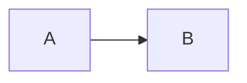
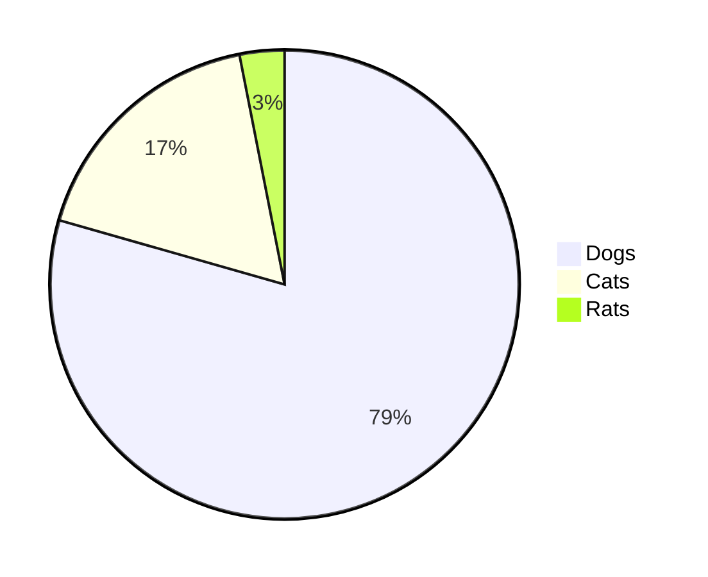

# Bacs Domain Live Dashboard 8-)

some text in a paragraph, maybe SLAs etc some links?

## Day 2 Processing

| Type               | &nbsp; &nbsp; &nbsp; &nbsp; Count &nbsp; &nbsp; &nbsp; &nbsp; | Sum of transactions (GPB)|
| :----------------- | :----------: | ----: |
| DirectDebits       | 26455 | 387645.63 |
| DirectDebitReturns | 364   | 7465 |
| DirectCredits      | 87364 | 3876456.45 |


```mermaid
graph TD
A[swift infrastructure] -->|{{swift-bacs-inbound-message}}| B(swift-bacs)
B --> C{Decision}
C -->|One| D[Result 1]
C -->|Two| E[Result 2]
```



