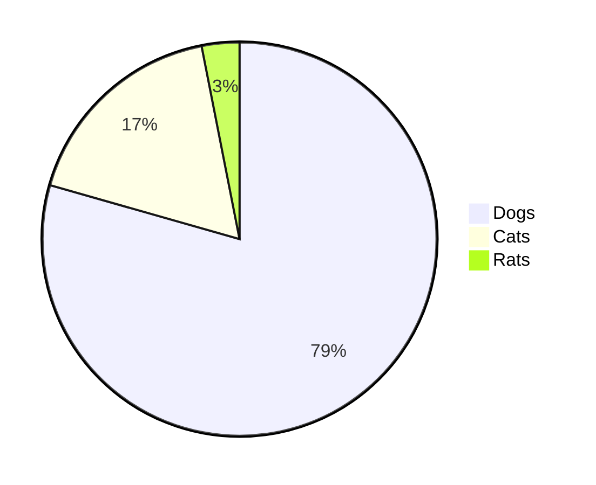

# h1 Heading 8-)

some text in a paragraph

| Option | Description | Rating |
| ------ | ----------- | ------ |
| data   | path to data files to supply the data that will be passed into templates. | 2 |
| engine | engine to be used for processing templates. Handlebars is the default. | 1 |
| ext    | extension to be used for dest files. | 7 |

### Diagram

```mermaid
graph TD
A[swift infrastructure] -->|{{swift-bacs-inbound-message}}| B(swift-bacs)
B --> C{Decision}
C -->|One| D[Result 1]
C -->|Two| E[Result 2]
```


