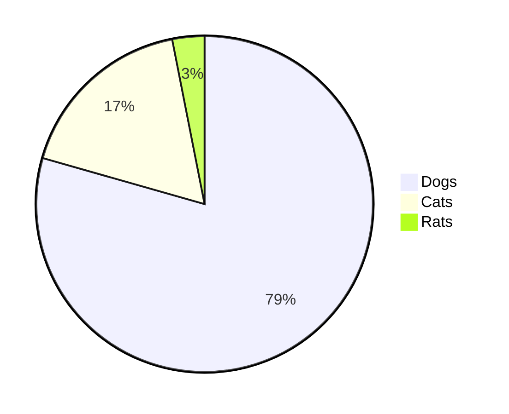

# Bacs Domain Live Dashboard 8-)

Some documentation should go here, maybe SLAs etc some links?

## Day 3 Processing scheduled transactions

{{livedocs.sp_get_day2_stats}}

```mermaid
graph TD
A[swift infrastructure] -->|{{swift-bacs-inbound-message}}| B(swift-bacs)
B --> C{Decision}
C -->|One| D[Result 1]
C -->|Two| E[Result 2]
```


