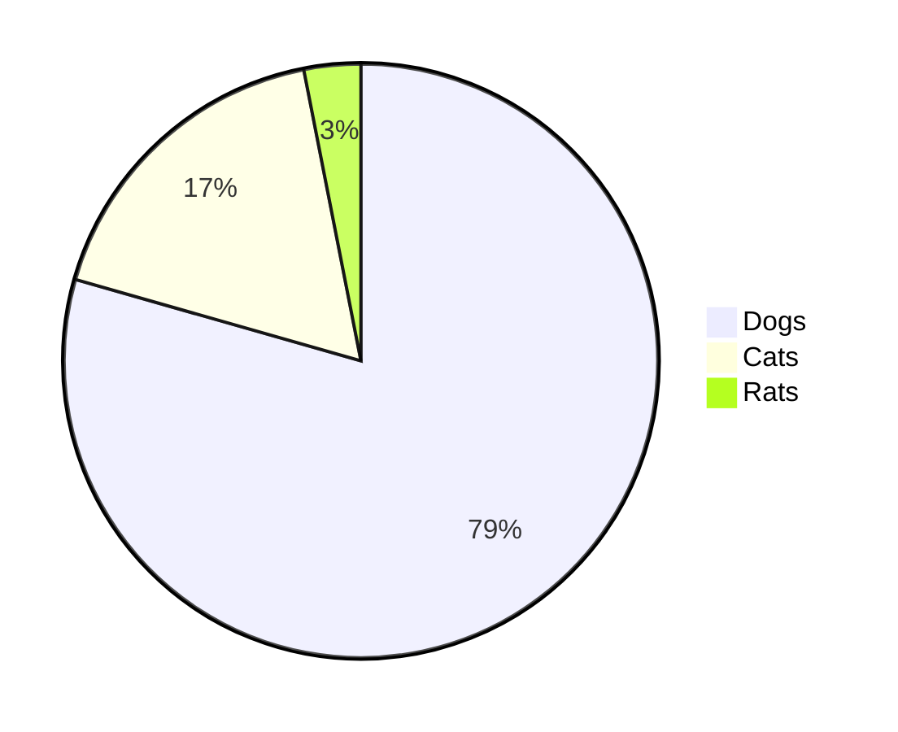

# Bacs Domain Live Dashboard 8-)

Some documentation should go here, maybe SLAs etc some links?

## Day 3 Processing scheduled transactions

{{livedocsdb.sp_get_day2_stats}}

```mermaid
graph TD
A[swift infrastructure] -->|{{swift-bacs-inbound-message}}| B(swift-bacs)
B -->|{{route-inbound-message}}| C{IsoRouter}
C -->|{{process-bacs-inbound-dc}}| D[BacsInboundPayments]
C -->|{{process-bacs-inbound-dd}}| D[BacsInboundPayments]
D -->|{{bacs-create-cash-transactions}}| E[Accounts]
D -->|{{bacs-send-webhook}}| F[WebHooks]
```


