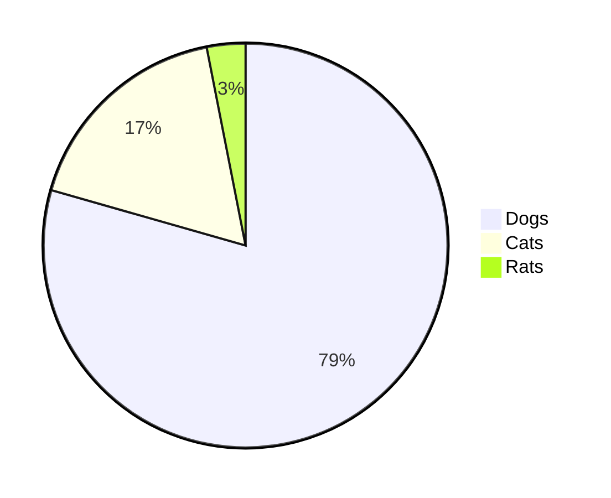

# Bacs Domain Live Dashboard 8-)

Some documentation should go here: 
* general description of the system
* maybe SLAs
* some links to existing documentation or dashboards?
* info on servicebus queues including what a DL means, what to do about it and how long you have to do it?
* what issues should/should not be escalated out-of-hours
* link to the repo(s)

## Day 3 Processing scheduled transactions

paragraph about Bacs day 3 processing etc

<<bacsdb.uspGetDay3SettlementOfTodayGroupedByTransactionType>>

<<bacsdb.uspGetDay3SettlementOfTodayGroupedByTransactionStatus>>

## Std18 File

```mermaid
flowchart TD;  
    %% define nodes
    s[Bacs Scheme STS service]    
    si(swift infrastructure)
    sb(swift bacs)
    ir(iso router)
    bpi2s(bacs payments inbound Day 2 Splitter)
    bpi2(bacs payments inbound Day 2 Processor)
    bpi3(bacs payments inbound Day 3 Processor)
    bm(bacs mandates)
    a(accounts)
    ss(settlement service)
    wh(webhooks)
    bdb[(bacs database)]

    %% define queues
    q1{{<<bacs-swift-inbound-payment-requests>>}}
    click q1 "https://portal.azure.com/#@cbinfrastructure.com/resource/subscriptions/0df249d7-9fde-4cd0-a580-9bf84a4406a4/resourceGroups/cbuk-core-testnarwhal-servicebus-uksouth/providers/Microsoft.ServiceBus/namespaces/cbuk-core-testnarwhal-servicebus-uksouth/queues/bacs-swift-inbound-payment-requests/overview" _blank
    q2{{<<iso-router-inbound-payment-request>>}} 
       
    %%q3{{<<bacs-outbound-batched-messages>>}}
    %%q4{{<<swift-send-message-request-queue>>}}

    q10{{<<inbound-bacs-pain-009 AUDIS setup>>}}
    q11{{<<inbound-bacs-pain-011 AUDIS cancel>>}}
    q12{{<<inbound-bacs-pain-008 credit>>}}
    q13{{<<inbound-bacs-pain-003 debit setup>>}}
    q14{{<<inbound-bacs-pain-004 return setup>>}}

    q20{{<<bacs-split-direct-credit>>}}
    q21{{<<bacs-split-credit-contra>>}}
    q22{{<<bacs-split-direct-debit>>}}
    q23{{<<bacs-split-debit-contra>>}}
    q24{{<<inbound-bacs-new-mandate>>}}
    q25{{<<inbound-bacs-mandate-migration>>}}

    q30{{<<bacs-process-pending-credit-transaction>>}}
    q31{{<<bacs-process-pending-debit-transaction>>}}
    q32{{<<bacs-process-pending-credit-transaction-contra>>}}
    q33{{<<bacs-process-pending-debit-transaction-contra>>}}

    %% define links with queue nodes
    s<-->|Soap connector|si
    si-->q1; q1-->sb
    %%sb-->q4; q4-->si
    sb-->q2; q2-->ir
    ir-->q10; q10-->bpi2s
    ir-->q11; q11-->bpi2s
    ir-->q12; q12-->bpi2s
    ir-->q13; q13-->bpi2s
    ir-->q14; q14-->bpi2s
    bpi2s-->q20; q20-->bpi2
    bpi2s-->q21; q21-->bpi2
    bpi2s-->q22; q22-->bpi2
    bpi2s-->q23; q23-->bpi2
    bpi2s-->q24; q24-->bm
    bpi2s-->q25; q25-->bm    
    bpi2-->q30; q30-->bpi3
    bpi2-->q31; q31-->bpi3
    bpi2-->q32; q32-->bpi3
    bpi2-->q33; q33-->bpi3
    bpi2-->bdb
    bpi3-->bdb
    bm-->bdb
    bpi3-->a
    bpi3-->ss
    ss-->wh
    %%bpi3-->q3; q3-->sb;
    
    %% add clickable links to queues
    
    
    click q3 "https://portal.azure.com/#@cbinfrastructure.com/resource/subscriptions/0df249d7-9fde-4cd0-a580-9bf84a4406a4/resourceGroups/cbuk-core-testnarwhal-servicebus-uksouth/providers/Microsoft.ServiceBus/namespaces/cbuk-core-testnarwhal-servicebus-uksouth/queues/bacs-process-pending-credit-transaction/overview" _blank
    click q4 "https://portal.azure.com/#@cbinfrastructure.com/resource/subscriptions/0df249d7-9fde-4cd0-a580-9bf84a4406a4/resourceGroups/cbuk-core-testnarwhal-servicebus-uksouth/providers/Microsoft.ServiceBus/namespaces/cbuk-core-testnarwhal-servicebus-uksouth/queues/bacs-process-pending-debit-transaction/overview" _blank
    click q5 "https://portal.azure.com/#@cbinfrastructure.com/resource/subscriptions/0df249d7-9fde-4cd0-a580-9bf84a4406a4/resourceGroups/cbuk-core-testnarwhal-servicebus-uksouth/providers/Microsoft.ServiceBus/namespaces/cbuk-core-testnarwhal-servicebus-uksouth/queues/bacs-outbound-batched-messages/overview" _blank
    click q6 "https://portal.azure.com/#@cbinfrastructure.com/resource/subscriptions/0df249d7-9fde-4cd0-a580-9bf84a4406a4/resourceGroups/cbuk-core-testnarwhal-servicebus-uksouth/providers/Microsoft.ServiceBus/namespaces/cbuk-core-testnarwhal-servicebus-uksouth/queues/swift-send-message-request-queue" _blank
    click q10 "https://portal.azure.com/#@cbinfrastructure.com/resource/subscriptions/0df249d7-9fde-4cd0-a580-9bf84a4406a4/resourceGroups/cbuk-core-testnarwhal-servicebus-uksouth/providers/Microsoft.ServiceBus/namespaces/cbuk-core-testnarwhal-servicebus-uksouth/queues/inbound-bacs-pain-009" _blank
    click q11 "https://portal.azure.com/#@cbinfrastructure.com/resource/subscriptions/0df249d7-9fde-4cd0-a580-9bf84a4406a4/resourceGroups/cbuk-core-testnarwhal-servicebus-uksouth/providers/Microsoft.ServiceBus/namespaces/cbuk-core-testnarwhal-servicebus-uksouth/queues/inbound-bacs-pain-011" _blank
    click q12 "https://portal.azure.com/#@cbinfrastructure.com/resource/subscriptions/0df249d7-9fde-4cd0-a580-9bf84a4406a4/resourceGroups/cbuk-core-testnarwhal-servicebus-uksouth/providers/Microsoft.ServiceBus/namespaces/cbuk-core-testnarwhal-servicebus-uksouth/queues/inbound-bacs-pain-008" _blank
    click q13 "https://portal.azure.com/#@cbinfrastructure.com/resource/subscriptions/0df249d7-9fde-4cd0-a580-9bf84a4406a4/resourceGroups/cbuk-core-testnarwhal-servicebus-uksouth/providers/Microsoft.ServiceBus/namespaces/cbuk-core-testnarwhal-servicebus-uksouth/queues/inbound-bacs-pain-003" _blank
    click q14 "https://portal.azure.com/#@cbinfrastructure.com/resource/subscriptions/0df249d7-9fde-4cd0-a580-9bf84a4406a4/resourceGroups/cbuk-core-testnarwhal-servicebus-uksouth/providers/Microsoft.ServiceBus/namespaces/cbuk-core-testnarwhal-servicebus-uksouth/queues/inbound-bacs-pain-004" _blank
    
    %% define styles (#ffd=external to CB, #cad=other CB teams, #aad=narwhal)
    style s fill:#ffd,stroke:#333,stroke-width:2px
    style wh fill:#cad,stroke:#333,stroke-width:2px
    style si fill:#cad,stroke:#333,stroke-width:2px
    style ss fill:#cad,stroke:#333,stroke-width:2px
    style ir fill:#aad,stroke:#333,stroke-width:2px
    style sb fill:#aad,stroke:#333,stroke-width:2px
    style bpi2 fill:#aad,stroke:#333,stroke-width:2px
    style bpi2s fill:#aad,stroke:#333,stroke-width:2px
    style bpi3 fill:#aad,stroke:#333,stroke-width:2px
    style bm fill:#aad,stroke:#333,stroke-width:2px
    style a fill:#cad,stroke:#333,stroke-width:2px   
    
```

<<TodaysStd18File>>

